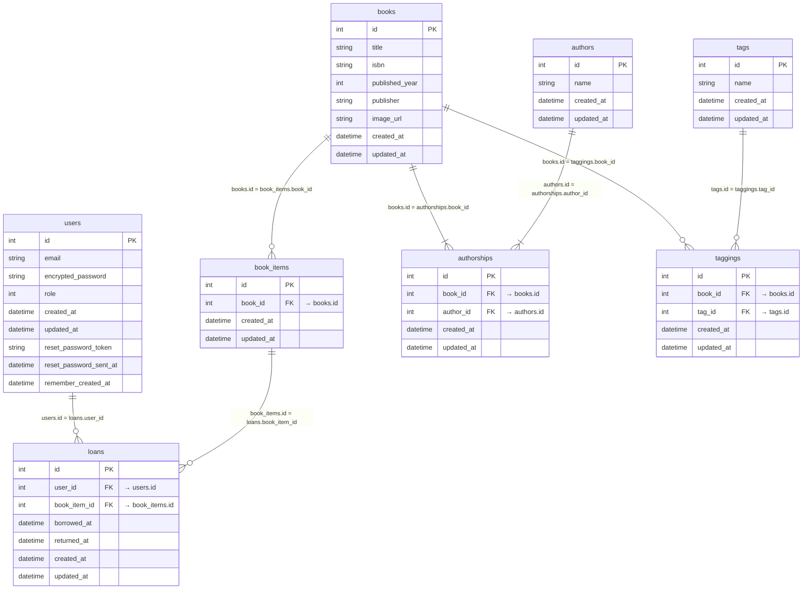

```mermaid
erDiagram
    users ||--o{ loans : "users.id = loans.user_id"
    books ||--o{ book_items : "books.id = book_items.book_id"
    book_items ||--o{ loans : "book_items.id = loans.book_item_id"
    books ||--|{ authorships : "books.id = authorships.book_id"
    authors ||--|{ authorships : "authors.id = authorships.author_id"
    books ||--o{ taggings : "books.id = taggings.book_id"
    tags ||--o{ taggings : "tags.id = taggings.tag_id"

    users {
        int id PK
        string email
        string encrypted_password
        int role
        datetime created_at
        datetime updated_at
        string reset_password_token
        datetime reset_password_sent_at
        datetime remember_created_at
    }

    books {
        int id PK
        string title
        string isbn
        int published_year
        string publisher
        string image_url
        datetime created_at
        datetime updated_at
    }

    book_items {
        int id PK
        int book_id FK "→ books.id"
        datetime created_at
        datetime updated_at
    }

    authors {
        int id PK
        string name
        datetime created_at
        datetime updated_at
    }

    loans {
        int id PK
        int user_id FK "→ users.id"
        int book_item_id FK "→ book_items.id"
        datetime borrowed_at
        datetime returned_at
        datetime created_at
        datetime updated_at
    }

    authorships {
        int id PK
        int book_id FK "→ books.id"
        int author_id FK "→ authors.id"
        datetime created_at
        datetime updated_at
    }

    tags {
        int id PK
        string name
        datetime created_at
        datetime updated_at
    }

    taggings {
        int id PK
        int book_id FK "→ books.id"
        int tag_id FK "→ tags.id"
        datetime created_at
        datetime updated_at
    }
```