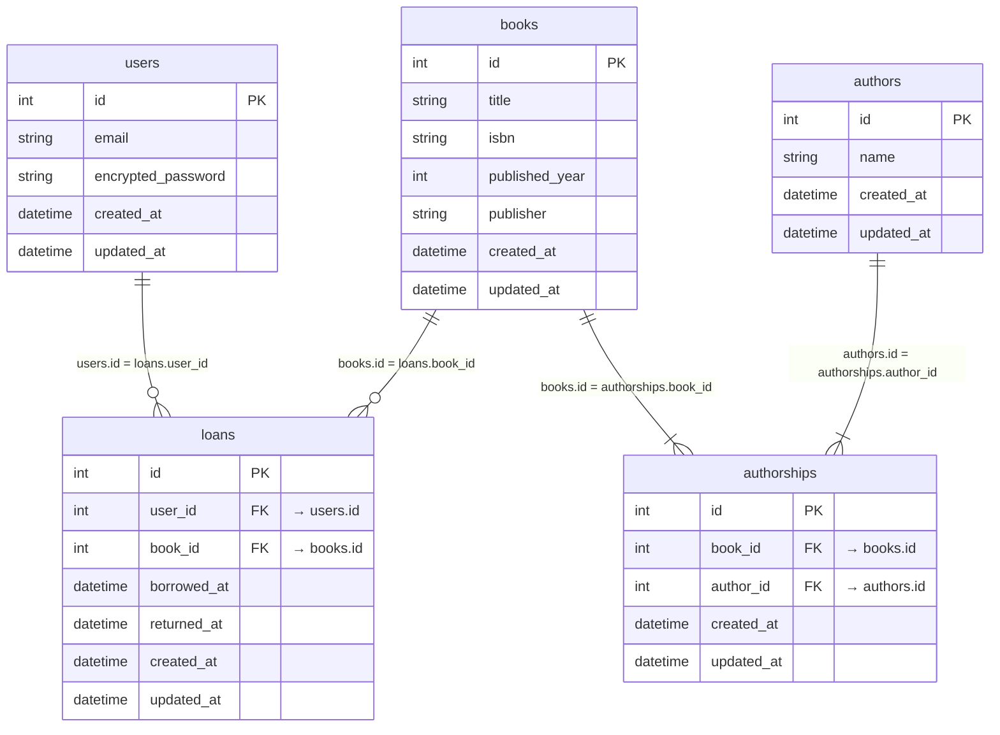

```mermaid
erDiagram
    users ||--o{ loans : "users.id = loans.user_id"
    books ||--o{ loans : "books.id = loans.book_id"
    books ||--|{ authorships : "books.id = authorships.book_id"
    authors ||--|{ authorships : "authors.id = authorships.author_id"
    
    users {
        int id PK
        string email
        string encrypted_password
        datetime created_at
        datetime updated_at
    }
    
    books {
        int id PK
        string title
        string isbn
        int published_year
        string publisher
        datetime created_at
        datetime updated_at
    }
    
    authors {
        int id PK
        string name
        datetime created_at
        datetime updated_at
    }
    
    loans {
        int id PK
        int user_id FK "→ users.id"
        int book_id FK "→ books.id"
        datetime borrowed_at
        datetime returned_at
        datetime created_at
        datetime updated_at
    }
    
    authorships {
        int id PK
        int book_id FK "→ books.id"
        int author_id FK "→ authors.id"
        datetime created_at
        datetime updated_at
    }
```